# UI inspirations for Herdlight

Three short X videos, studied frame by frame (4 fps). Raw videos and all frames are in `a/`, `b/`, `c/`. The chosen frames are in `selected/`.

| Video | Post | App | Length |
|---|---|---|---|
| A | [@yiliush](https://x.com/yiliush/status/2105397619971531178) | **Cube Computer** desktop app ("Cloud" workspace), [cube.computer](https://cube.computer) | 6 s |
| B | [@badlogicgames](https://x.com/badlogicgames/status/2107921299297177833) | **Rex** by Superlogical, showing pi with OSC 7501 status | 11 s |
| C | [@mitchellh](https://x.com/mitchellh/status/2087537750182666290) | **Rex** by Superlogical, "tab peek" and mission control | 13.5 s |

Notes:
- Video A is not Superlogical. It is Cube Computer, an always-on cloud machine for coding agents with a Mac app (the tweet calls it an "ADE").
- B and C show the same app: Superlogical's terminal multiplexer, **Rex** ([superlogical.com](https://www.superlogical.com), [announcement](https://mitchellh.com/writing/superlogical)). The team includes Mitchell Hashimoto (Ghostty), and the UX design is by Alasdair Monk. Sessions are long-lived and run on a server. Clients are web, macOS and iOS. Scrollback, selection and scrolling work natively.

---

## A — Cube Computer: sidebar + horizontal strip of mixed panes

### What it is
A Mac client for a personal cloud machine. Agents (Claude Code, Codex) run in worktrees on the machine. The client mixes terminals, live web previews of ports forwarded from the machine, and native panels such as a file tree. The website says "Group sessions into screens: put related agents and terminals on the same screen."

### Structure
- **Window chrome:** traffic lights, then a sidebar-toggle icon. The **tab bar sits in the title bar**, centred over the content area. A "Download & Update" capsule sits at the far right.
- **Sidebar (~400 px of 1600):** warm dark aubergine/brown tint (`~#3a2a30`), no hard border.
  - Header: cube logo, a large bold "**Cloud**" (the machine name), small `>_` and folder icons, then a segmented control: **Repos | Agents | Machine**.
  - "+ Add Repo", then a tree of repos with dim count badges ("cube-computer 5"). Expanded repos list their sessions. Each session has an icon by kind: a Claude asterisk for an agent, a globe for a web page, `>_` for a terminal, and a dim right-aligned process name ("node"). Agent sessions show a small **blue unread dot** on the icon.
  - The selected row has a subtle lighter rounded fill.
  - Bottom card, "Localhost ports: cloud → local": one row per forwarded port (`Cube Studio 4173 → 4173`) with "open externally" and "open as pane" buttons, plus a pause control. The ports are green.
  - Footer: cloud/local toggle and a settings gear.
- **Content area:** one horizontally scrolling strip of **screens**. Each screen fills the visible width and holds 1–2 panes. In the demo:
  1. Terminal + web page (a review doc), half and half.
  2. "Studio": a single full-width web app.
  3. `/docs`: a single full-width terminal running Claude Code.
  4. Terminal + "Primary worktree" file tree, half and half.
  5. An empty screen.
- **Tabs map 1:1 to screens.** A tab shows a text label ("Cube web browser", "Studio", "/docs"). A screen of splits shows a small **two-rectangle split glyph** instead of a name. An empty screen shows a blank pill. Tabs are small rounded rectangles (~6 px radius) with a grey fill. The active tab has a light 1 px outline. A blue dot on a tab means activity in that screen.

### Horizontal scrolling and tab switching
- With a two-finger trackpad swipe, the whole strip slides continuously. Pane content does not reflow during the slide. Panes slide under the sidebar edge and are clipped there (frames a-02, a-04, a-06).
- **Every tab whose screen is visible in the viewport is highlighted at the same time.** Mid-scroll, both "Cube web browser" and "Studio" are outlined (a-02). When the scroll settles, one tab stays lit. The tab bar therefore works like a minimap or scroll indicator, not only a set of buttons.
- The strip appears to settle on screen boundaries (paging). Each rest frame shows exactly one screen.
- A thin, short **scroll thumb** sits at the bottom edge of the strip and shows the position.

### Web pages between terminals
Web panes are real browser views of forwarded ports, with no browser chrome inside the strip (no URL bar in the video). A web pane is a peer of a terminal pane: same card shape, same height, same gaps. The sidebar's ports card is the way to open them.

### Panes
- Each pane is a rounded card (~12 px radius) on the window background, with ~10 px gaps. Terminal panes are slightly lighter than the sidebar.
- Terminal pane header: agent icon, a green "running" ring icon, then the title (`✳ Seed fundraise long form deck`). On the right: **maximize** and **close** icons. The header is thin (~28 px) and uses small grey text.
- The file-tree pane uses the same header pattern: a green ring, "Primary worktree", a search field, and a tree with dim counts.
- Splits are equal-width columns. The video shows no resizing.
- Empty screen: a faint cube logo and three cards — **Add Repo**, **New Agent** ("Codex · choose a repo") and **Open Terminal** ("~ on your cloud machine").

### Look
- Warm dark theme: the sidebar is aubergine/brown, the content background is a slightly different dark, and the terminals are near-black warm grey.
- UI text is SF Pro: 13 px rows, a 22 px bold title, grey secondary text. Terminal text is SF Mono / Menlo.
- No visible Liquid Glass. The design is flat and dark, with subtle fills.

### Selected frames
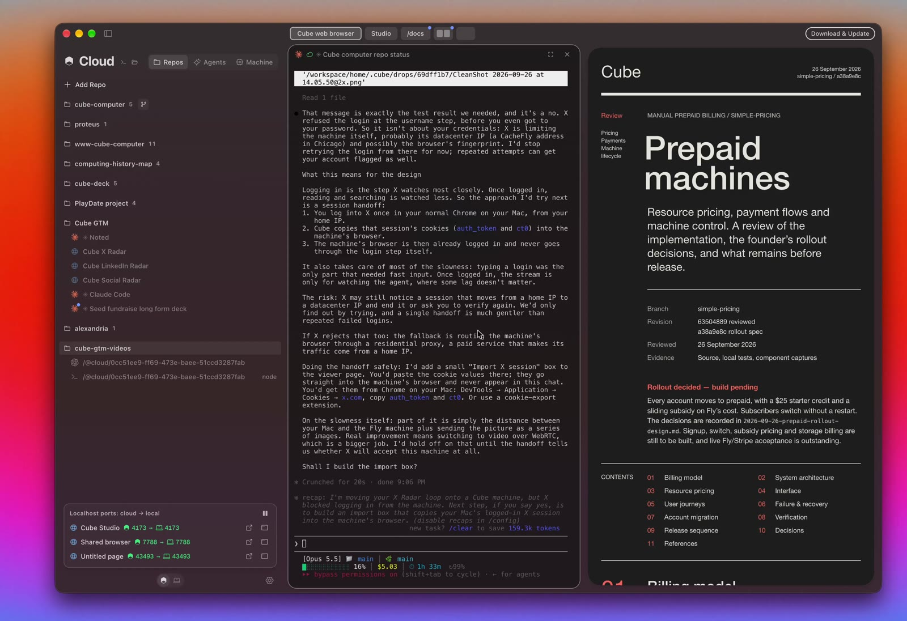
*a-01: Screen 1, terminal and web page side by side. The sidebar holds the repo/session tree and the forwarded-ports card. Tabs are in the title bar.*

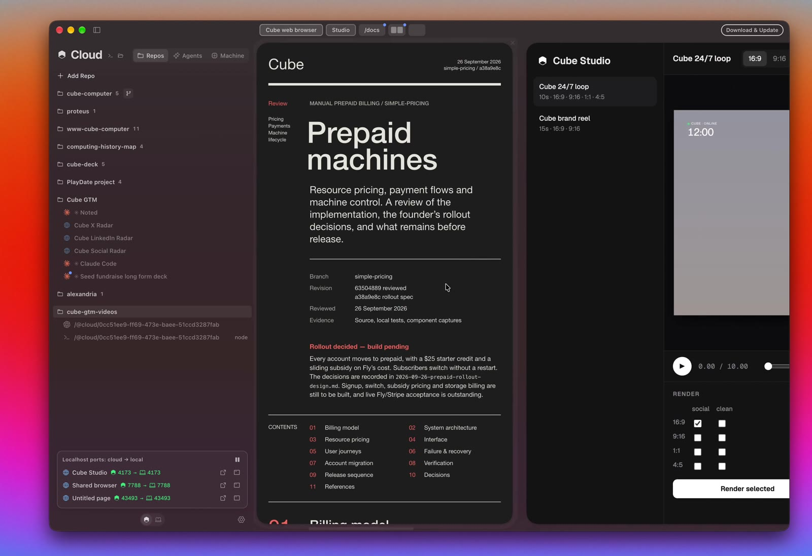
*a-02: Mid-swipe. The web pane slides under the sidebar edge and Studio slides in. Both "Cube web browser" and "Studio" tabs are outlined, because both screens are visible.*

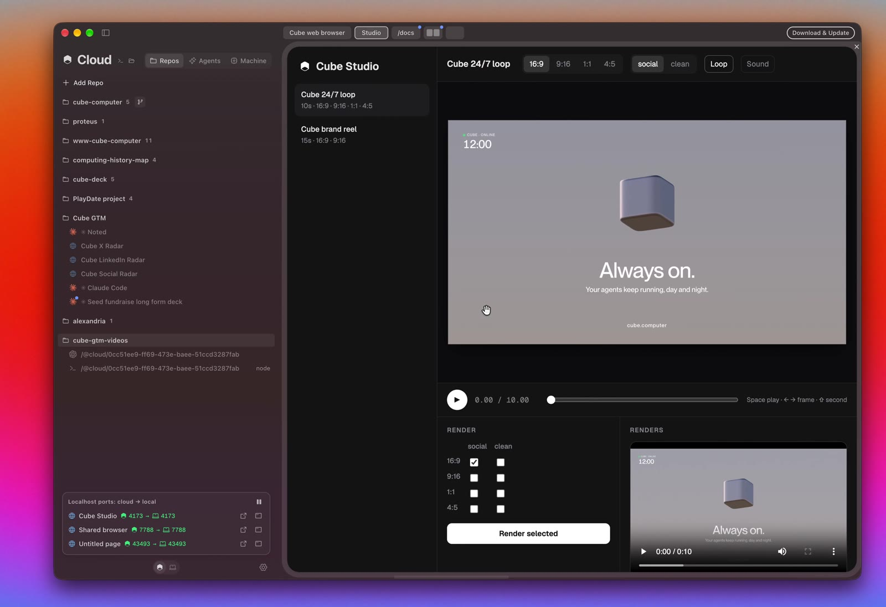
*a-03: "Studio" screen, a single full-width web app served from the cloud machine.*

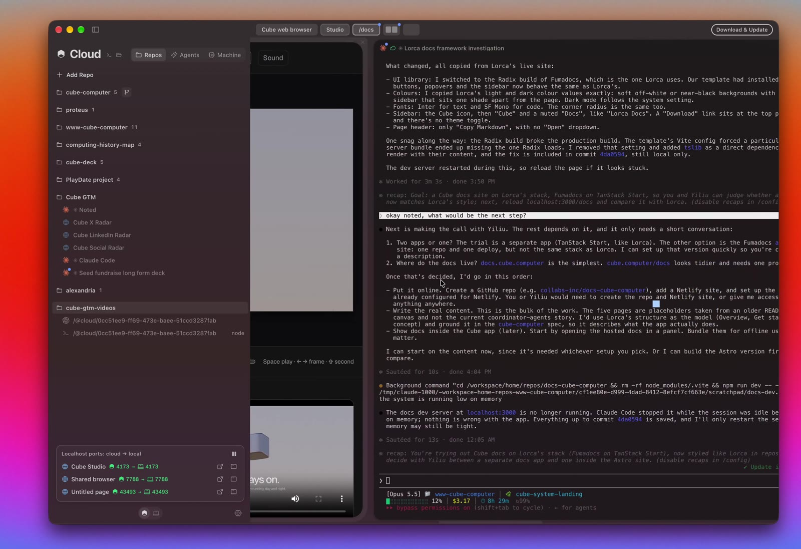
*a-04: Studio → /docs transition. Content keeps its width and only translates.*

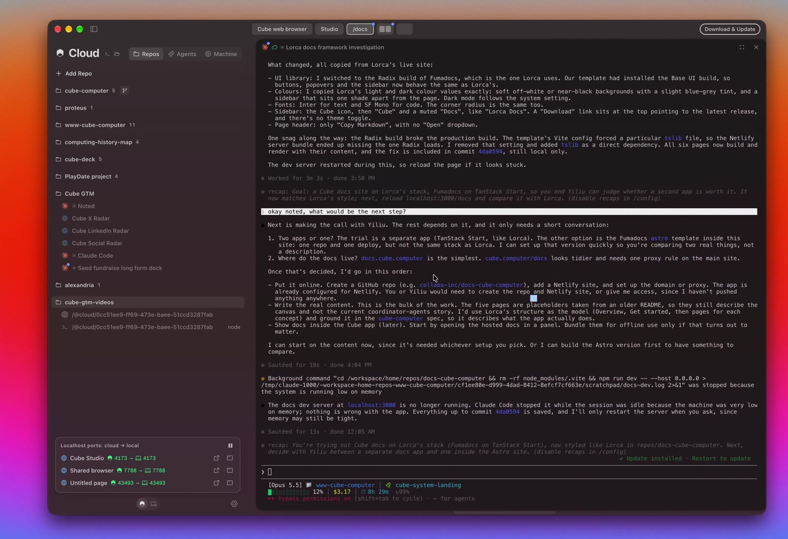
*a-05: "/docs" screen, a single full-width Claude Code terminal. Note the scroll thumb at the bottom.*

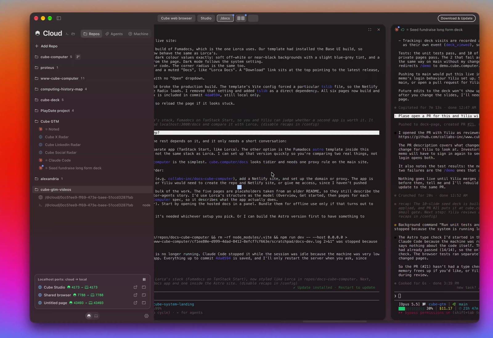
*a-06: /docs → split screen. The terminal is clipped at the sidebar edge and does not resize.*

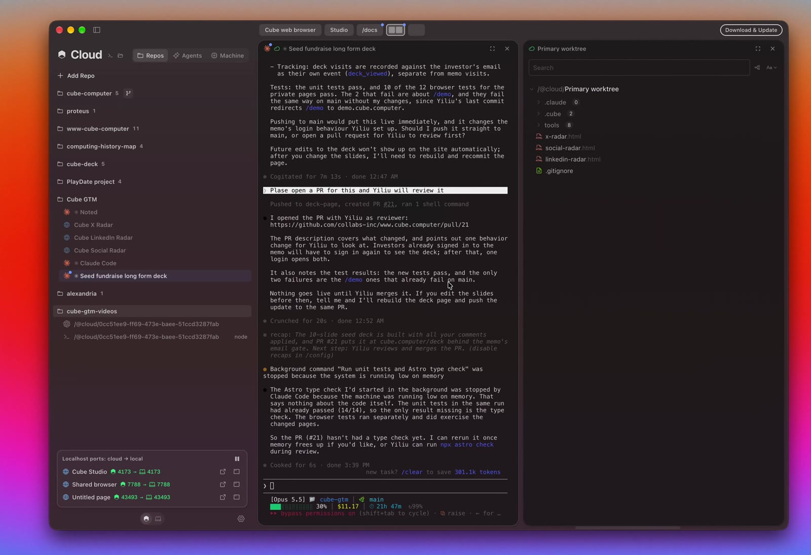
*a-07: Split screen with a terminal and a native "Primary worktree" file tree. The tab is the two-rectangle split glyph. The sidebar row is selected to match the focused session.*

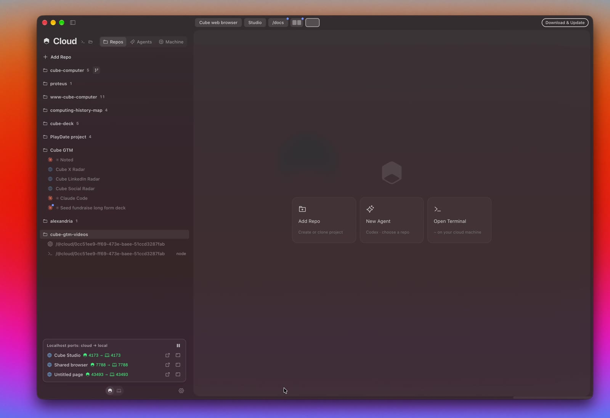
*a-08: Empty last screen with Add Repo / New Agent / Open Terminal cards.*

---

## B — Rex: program status in tabs (OSC 7501)

### What it is
The same Rex app, cropped to the content. pi runs in two splits. When pi starts working, the **tab** for that session shows its state, reported by the program over [OSC 7501](https://mitchellh.com/writing/program-status-osc7501). OSC 7501 is an escape sequence with the states `idle`, `working` (optional `progress`), `blocked` (with a kind, e.g. permission), `done` and `error`, plus `msg` and `app` keys. Our app could get the same signal from herdr's agent-state detection.

### Structure
- **Top bar (~44 px):**
  - Left: a pill-shaped "session/host" button (a screen-with-person icon) and a stack icon (session list/overview).
  - Middle: **capsule tabs**. Each tab has a rounded-square **app icon** (the pi logo, or the green `>_` for zsh) and a title ("π - pi", "zsh ~/workspaces/pi"). The directory part of the title is dimmer.
  - Right: `⌘` (command palette) and `+` (new tab).
- **Active tab:** a filled capsule with a faint lighter outline. Inactive tabs have no fill, or a darker fill.
- Hovering a tab shows an **×** at its right end.
- **Splits:** rounded cards (~10 px radius) with a ~8 px gutter on a near-black background (`#0d0f12`). Each pane header has the app icon and title. On the right are **split-vertical, split-horizontal, zoom (↗↙) and close** icons. These appear on the focused pane and are dim on the others.

### Status animation (key idea)
- While pi is working in a **background** tab, an animated **"•••"** appears at the right end of that tab (b-03).
- When pi finishes, the dots disappear and the tab's app icon gets a **blue dot badge** at its top-right corner (b-04): "done, not seen yet".
- Inside the pane, pi's own TUI shows "⠋ Working". The tab mirrors that state without heuristics.

### Focus
- The **unfocused split is dimmed.** Its text is greyer and its block cursor is grey and hollow-looking. The focused split has bright text and a white cursor (b-05). The difference is subtle, but it is easy to read at a glance.

### Selected frames
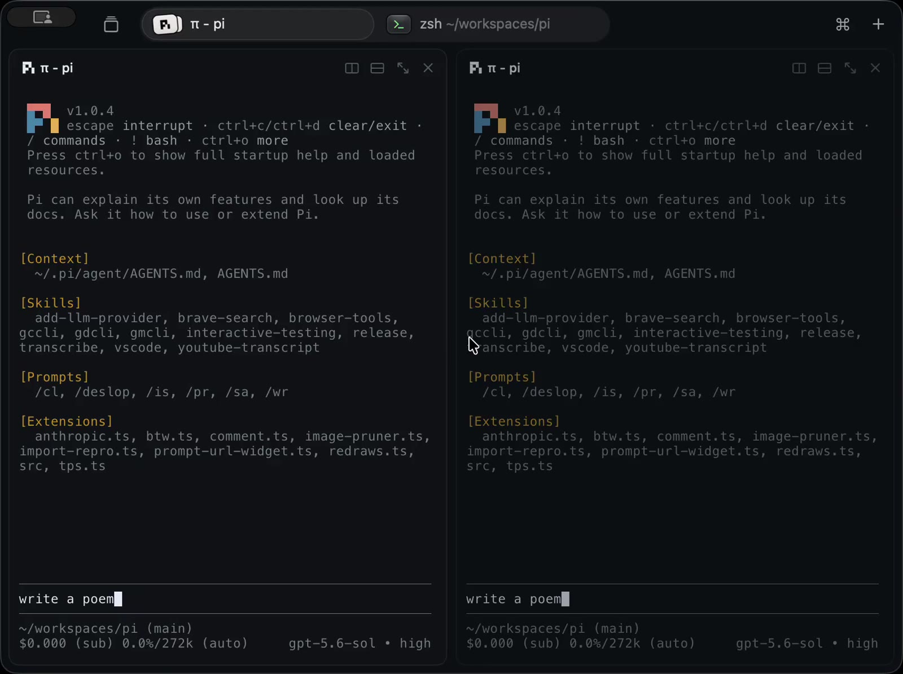
*b-01: Two pi splits in one tab. The pane header controls are on the right of the focused pane.*

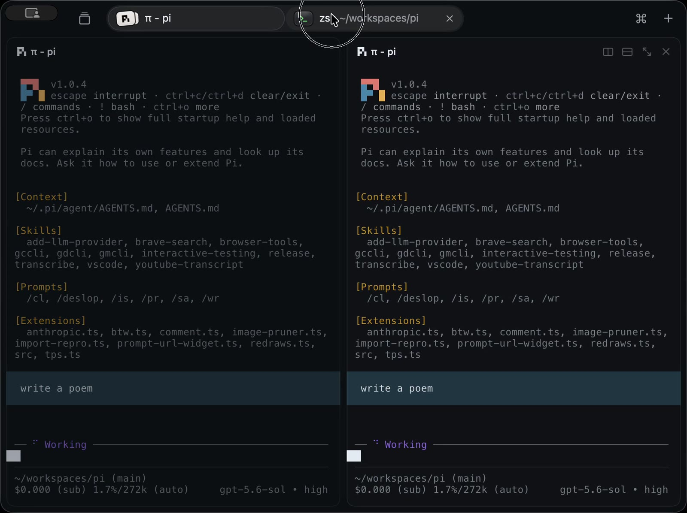
*b-02: Both splits are "Working". Hovering the zsh tab shows its close ×.*

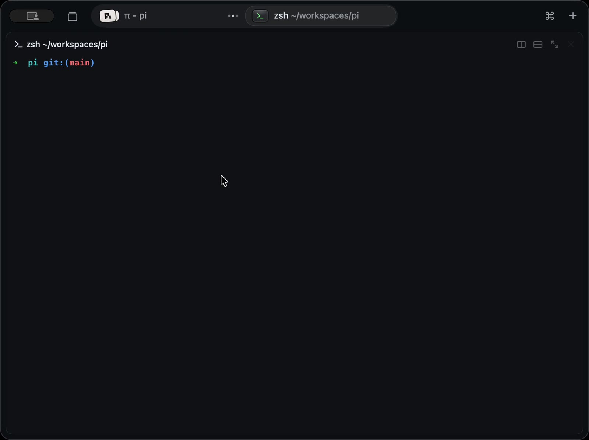
*b-03: On the zsh tab, the background pi tab shows animated "•••" while pi works.*

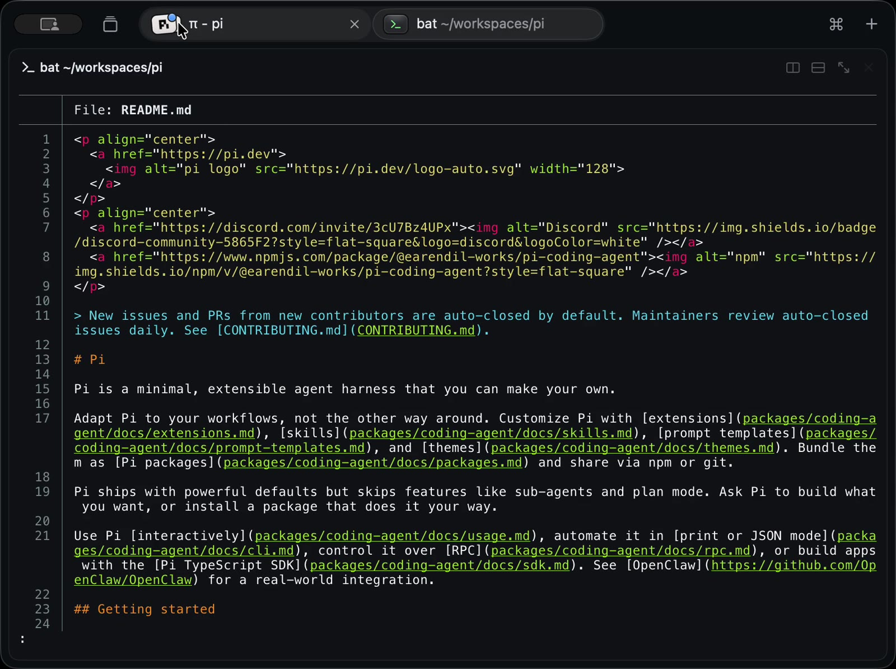
*b-04: pi finished. A blue dot badge appears on the pi tab's icon.*

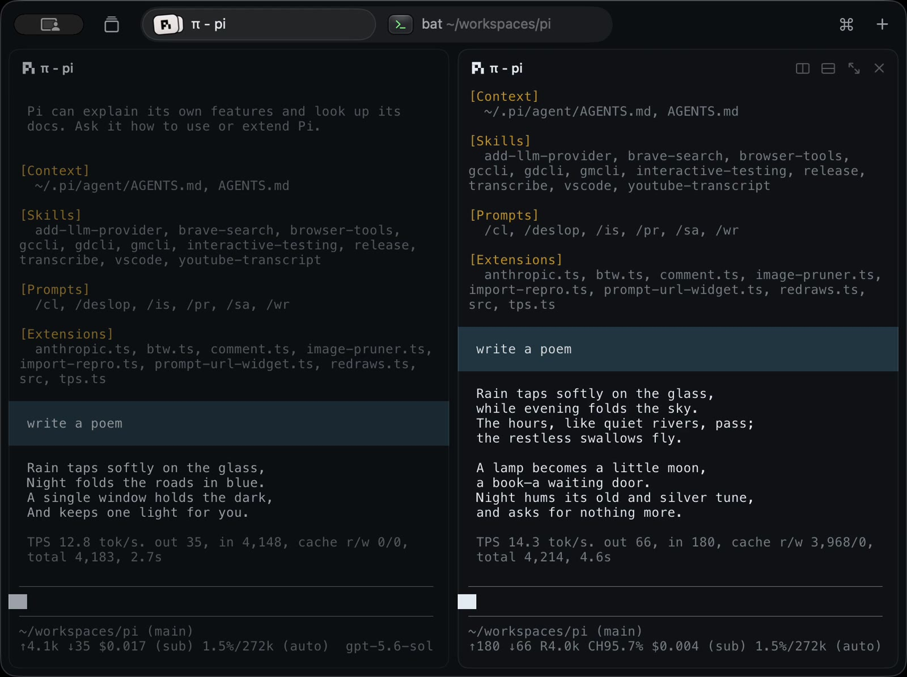
*b-05: The left split is unfocused and dimmed. The right split is focused, with bright text and a white cursor.*

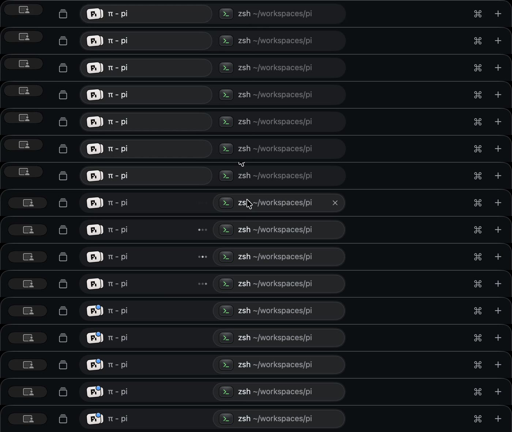
*b-06: Tab bar over time, top to bottom: idle → hover × → working "•••" → done blue badge.*

---

## C — Rex: tab peek and mission control

### What it is
Same app, a full window on a light wallpaper. The tweet: *"If you three-finger swipe down, you can 'peek' at the other session tabs. These are live-updating, metal-rendered previews including splits. If you keep dragging, you enter a 'mission control' style mode… The peek pushes the terminal down off screen, it doesn't resize it, so it doesn't force any weird reflow… you'll be able to drive this with the keyboard too."*

### Structure
- A single-window terminal. The tab bar is in the title bar, after the traffic lights and a stack icon.
- Tabs are equal-width. Each has a **stacked-cards app icon** (`>_`) and a truncated title. Thin vertical separators sit between inactive tabs. The active tab is a soft capsule. `+` is at the far right.
- The content is one pane card inset ~12 px from the window edge, with a large radius. Its header has the `>_` icon, the title ("~/Apps/replay-web: pnpm dev - pnpm") and split/zoom/close icons.
- **Material:** the window background is a dark translucent material, and the wallpaper is faintly visible through it. This is the macOS 26 Liquid Glass / vibrancy look: no hard border, a large window radius and a soft shadow. Chrome stays minimal. There is no visible sidebar.

### Tab peek (three-finger swipe down)
1. As you drag down, each **tab grows downward into a live thumbnail** of its session, including splits. The thumbnails are scaled renders, not snapshots.
2. The terminal card **slides down as a unit**. It is pushed partly off the bottom and keeps its size (c-02).
3. Hovering a thumbnail highlights it with a lighter rounded backing and shows ×. Clicking it switches the tab, and the pushed-down content changes immediately (c-03).
4. If you keep dragging, the thumbnails detach from the tab bar and fly into a centred **2×2 grid** under a section label ("Default"). The terminal card falls off the bottom edge (c-04 → c-05).
5. Mission control shows bigger live tiles with icon + title headers. Hover highlights a tile and shows ×. Clicking a tile returns to the normal view with that tab active (c-06 → c-07).
6. The motion follows your finger and is interruptible: the frames show continuous scale and translate, with no fades.

### Look
- Dark charcoal panes (`~#262626`), with less colour than Cube.
- SF Pro titles at ~15 px for tabs and headers, with a lighter weight for the directory part. The terminal font is a Menlo-like mono.
- The light desktop wallpaper shows that the window is translucent.

### Selected frames
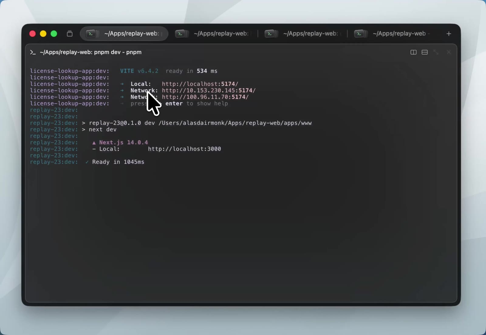
*c-01: Resting state: tabs in the title bar and one inset pane card. The window material is dark and translucent.*

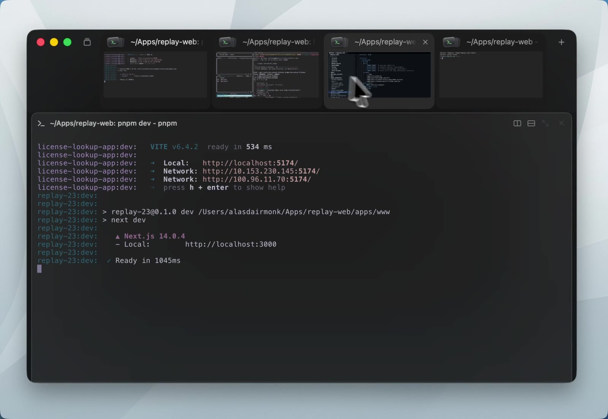
*c-02: Three-finger swipe down. The tabs expand into live thumbnails and the terminal is pushed down without resizing.*

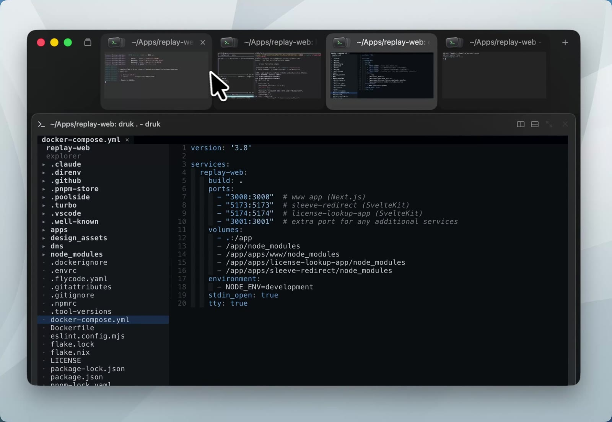
*c-03: During peek, clicking or hovering a thumbnail switches the active tab, and the content below updates.*

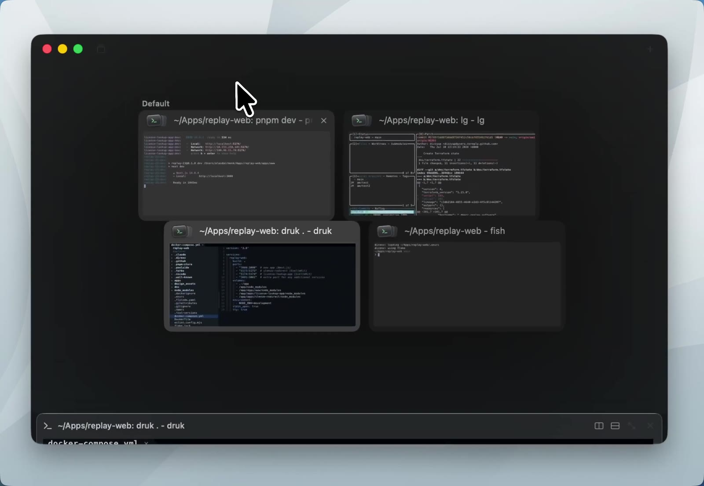
*c-04: Further drag. The thumbnails fly into a grid and the terminal slides off the bottom.*

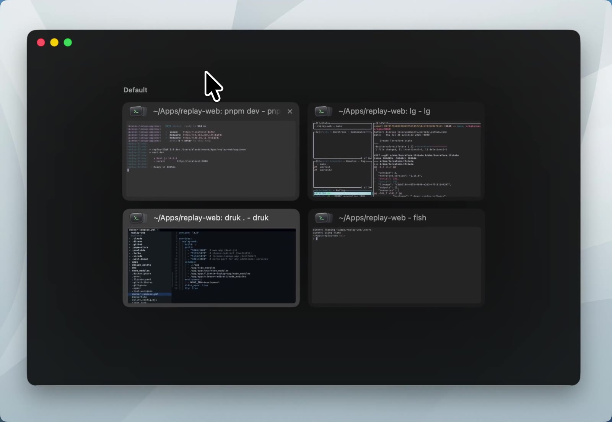
*c-05: Mission control: a 2×2 grid of live session tiles under the "Default" group label.*

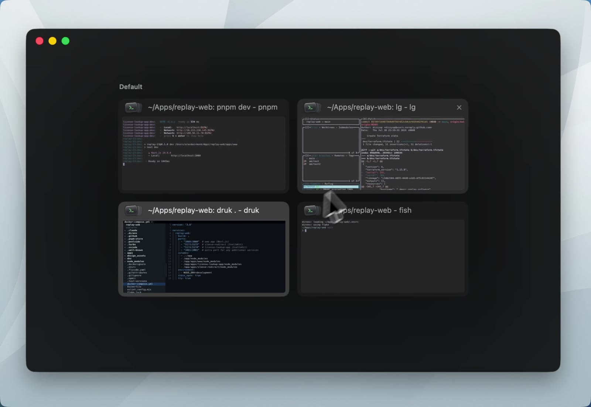
*c-06: The hovered tile lifts (lighter backing, × appears). Click to open it.*

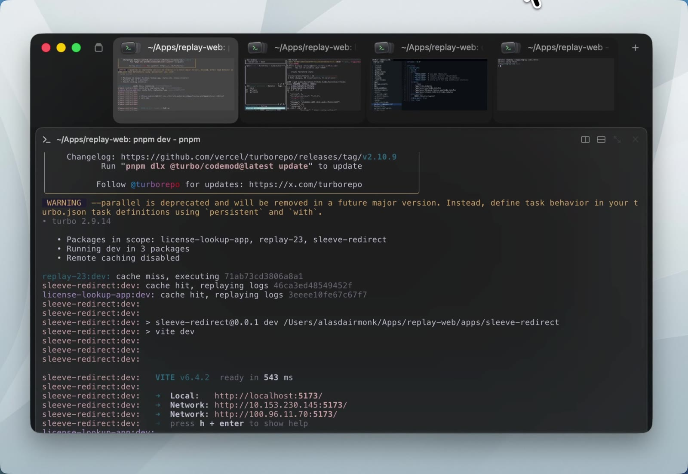
*c-07: Back to the terminal, then peek again. The tab bar's thumbnails show where everything is.*

---

## Design takeaways for our app

Map to herdr: **workspace → sidebar group, tab → screen in the strip, pane → card**.

1. **Sidebar = workspaces and sessions, with state on every row.** Use Cube's tree: workspace header, panes or agents under it, a kind icon (agent, terminal, web), a dim process name, and a blue unread/done dot. Feed the dots from herdr's agent state (idle/working/blocked/done) and from OSC 7501 when a program supports it.
2. **Tabs go in the title bar, as capsules with app icons.** Show the program icon and the title, with the cwd dimmed. Show × on hover, and `⌘` and `+` at the right.
3. **Status lives in the tab, not only in the pane.** Animate "•••" for working, show a blue badge for done and unseen, and add an amber/red variant for blocked or error. Clear the badge when the tab gets focus. This is the most useful idea in these videos for an agent multiplexer.
4. **Tabs as one horizontal strip of screens (Cube).** Swiping horizontally pans continuously through tabs and settles on screen boundaries. **Light up every tab that is visible in the viewport**, so the tab bar works as a minimap. Translate content during the pan and never resize it. Clip at the sidebar edge. Add a thin scroll thumb.
5. **Web panes are first-class peers.** Same card, same header (globe icon, title, maximize/close), placed between terminals in the strip. Open them from a "ports" list, as Cube does. herdr could detect listening ports per workspace.
6. **Pane cards.** Use a ~10–12 px radius, an 8–10 px gutter, and a thin header with icon + title. Put split/zoom/close icons on the right, shown on the focused pane and dim elsewhere. **Dim unfocused panes** a little (text and cursor) instead of drawing heavy focus borders.
7. **Peek and overview gestures (Rex).** A three-finger swipe down (plus a keyboard shortcut) grows the tabs into live thumbnails and pushes the content down without reflow. Dragging further opens a mission-control grid grouped by workspace. Make it follow the finger and be interruptible. Thumbnails show the shape of each tab, so they do not need readable text. Render them from the pane snapshots we already have.
8. **Empty states with action cards.** New screen: "Open Terminal / New Agent / Open Web Page", centred, with a faint logo.
9. **Materials.** Use Liquid Glass (`.glassEffect` / `NSGlassEffectView`) only for the window/tab bar background and floating overlays (peek, overview, palette). Keep the panes opaque and dark for terminal legibility. Use one restrained accent: blue for attention, green for running.
10. **Typography.** SF Pro 13 pt for rows and 15 pt for tab/pane titles, with secondary text in `secondaryLabel`. Use a user-configurable mono font for terminals. Keep the chrome thin so most of the window is content.
