# One (getone.one): the edge pill for coding agents

One is a Mac app (plus iPhone app and Linux connector) that shows every coding
agent as a dot in a small black pill on the right edge of the screen. Questions
and finished work collect in an Inbox card next to the pill, and you answer
with one key. **It is built on herdr**: to answer, stop or message an agent
from One, the agent must run in herdr. That makes it the closest existing
product to what Herdlight's status area wants to be.

Raw material is in `one-app/`; chosen frames are in `selected/one-*.jpg`.

## Sources

| What | Where | Notes |
|---|---|---|
| Landing page | https://getone.one/ (saved: `one-app/index.html`) | Live HTML/CSS mockup of the pill and Inbox; 19 s loop ("Agents ask → You answer in a keystroke → Or from your phone"). Captured 1 fps in `one-app/demo/t_*.jpg`; its DOM in `one-app/demo/demo.html` gives exact CSS. Page sections in `one-app/page/`. |
| Founder video, landing page | YouTube `Xq7jUy7dch4` (`one-app/video.mp4`, 69 s) | Camera filming a laptop: early UI (vertical capsules, session list, chat window, recording). Frames: `one-app/frames/`, `one-app/hi/`. |
| Launch video, 6 Oct 2026 | https://x.com/ky__zo/status/2107549434280284460 (`one-app/x_2107549434280284460.mp4`, 4K, 31 s) | Clean motion-graphics of the shipped UI. Frames: `one-app/xl/`. |
| "Usage metrics" video, 15 Sep 2026 | https://x.com/ky__zo/status/2099679560099103115 (`one-app/x_2099679560099103115.mp4`, 21 s) | Real screen recording: pill hover, usage popover, torn-off chat window. Frames: `one-app/xs/`. |
| Remote machines guide | https://getone.one/docs/remote-machines | How the connector reads herdr and acts on agents. |
| Privacy policy | https://getone.one/privacy | What is sent where; permissions. |
| Third-party write-up | https://cellcog.ai/blog/one-app-coding-agents/ | Launch date, pricing, agent list. |
| Images | `one-app/img/` | Logo/mascot, agent icons (claude, codex, opencode, pi, omp, amp, grok), dock icons, hero background, OG image. |

No changelog or docs index exists (`/changelog`, `/docs` return 404). No
Product Hunt page found. The author is kyzo (@ky__zo).

## What One is

- **Parts** (homepage): *Toolbar* ("a dot for every agent, at the edge of
  your screen; blue is working, amber needs you, green is done"), *Inbox*
  ("every agent's questions and finished work, in one list; press 1, 2 or 3"),
  *Router* ("double-tap Option and say what you need, or type it; One sends
  it to the right agent, or starts a new one"), *iPhone app*, *Server
  connector*.
- **Agents**: Claude Code, Codex, OpenCode, Pi, Omp, Amp, Grok.
- **Platform**: macOS 13+, Apple silicon and Intel; iPhone/iPad iOS 17+
  (TestFlight); Android via `getone.one/remote` in a browser.
- **Permissions** (FAQ): Microphone, Accessibility ("so the shortcut works in
  every app"), Screen Recording (screenshot sent with each request),
  Automation (control the terminal app).
- **How it gets agent state** (stated):
  - Onboarding: "One can see your local agent sessions… One reads the visible
    output of your terminals and your agents' recent transcripts" (frame
    `one-app/hi/f_20.5.jpg`).
  - FAQ: agents in other terminals "still show up", but answering, stopping
    or messaging needs herdr. "Move to herdr and send" closes the agent in
    the other terminal and reopens the same conversation in herdr. Every
    agent One starts runs in herdr.
  - Remote connector: "Reads herdr's list of agents and each agent's
    conversation, from Claude Code's and Codex's own session files, or from
    the terminal screen when there is none. It looks every 2.5 seconds while
    you're watching and every 10 seconds otherwise." It "answers a numbered
    question with its digit key after checking the question is still the one
    you answered, presses Esc to stop an agent, closes its herdr pane to kill
    it, and starts a new agent in a folder".
  - Guess: on the Mac it does the same as the connector (herdr agent list +
    transcript files + screen text). The connector description is the only
    detailed account.
- **AI on top**: routing, titles ("Pricing page", "Stripe checkout"), recaps,
  and up to two suggested "next steps" use an LLM (your ChatGPT plan or
  OpenAI key first, then One's servers). Not relevant to Herdlight.

## Every UI state

### 1. Collapsed pill (resting state)
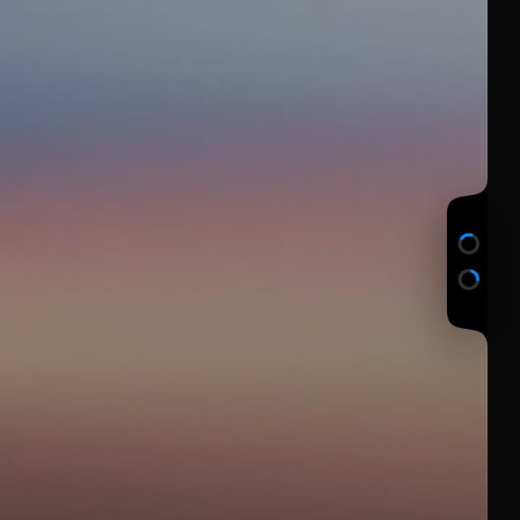
*Collapsed: a black tab glued to the right screen edge, one status glyph per agent. Here two agents work (blue spinning rings). Landing-page mockup, `one-app/demo/t_00.jpg`.*

- Shape from the DOM: a 25 × 104 px SVG, `fill="#000"`, path
  `M25 0 C25 18.7 0 3.3 0 22 L0 82 C0 100.7 25 85.3 25 104 Z`. The top and
  bottom curve *outwards* into the screen edge, like the MacBook notch turned
  90°. It looks like hardware, not a window. Drop shadow
  `0 6px 14px rgba(0,0,0,.45)`.
- Vertically centred on the right edge, 14 px of it past the edge in the
  mockup.
- Glyphs, 13 px, 9 px apart: working = ring `border 2px white/20` with a
  blue `#0a84ff` top segment, spinning (0.95 s and 1.3 s per turn, so
  neighbours don't spin in sync); needs you = solid amber dot (~`#ffc542`);
  done = solid green `#30d158`; idle/seen = grey dot.
- Height grows with the agent count (frame `one-app/xl/f_016.jpg`: 4 glyphs).
- In the real recording (`one-app/xs/f_001.jpg`) the pill is only a thin dark
  sliver at the edge until the pointer comes near it.

### 2. Attention toast ("Agent needs you")
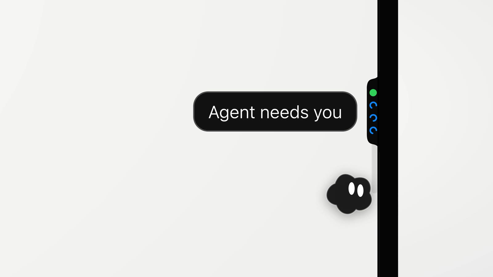
*A black capsule toast slides out to the left of the pill when an agent becomes blocked; the mascot sits under it. Launch video, `one-app/xl/f_016.jpg`.*

Other one-line toasts seen under the Inbox card: "Sent to claude-7" with a
green check, "Press 1, 2 or 3 to answer", "Both agents are back at work."

### 3. Expanded toolbar
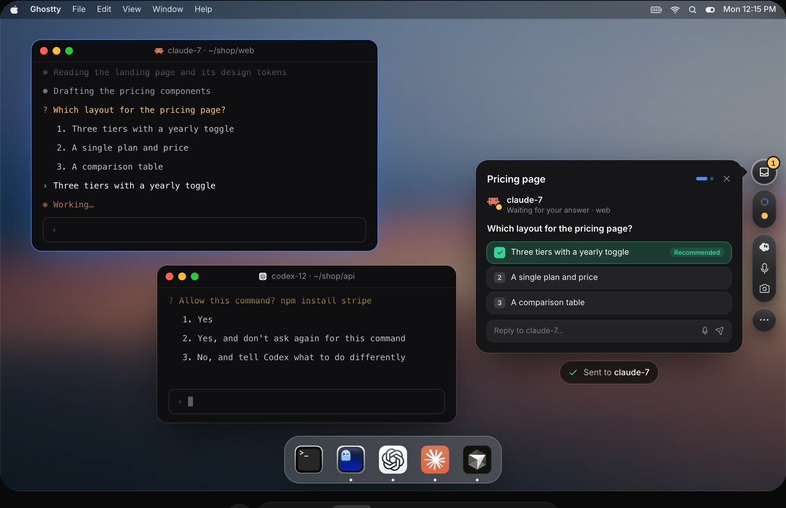
*Hover (or a blocked agent) turns the pill into a column of round dark buttons: Inbox with a count badge, the agent dots, the Router group (One, mic, camera), and "…". Landing-page mockup.*

- The pill fades out while the column fades in from `translateX(18px)
  scale(0.92)`, origin right-centre (from the DOM). So it "grows out of" the
  edge.
- Every button is a 34 px circle or 34 px-wide capsule:
  `linear-gradient(180deg,#48484c,#2a2a2d 55%,#232326)`, inner highlight
  `inset 0 1px 0 rgba(255,255,255,.2)`, hairline `inset 0 0 0 1px
  rgba(255,255,255,.08)`, shadow `0 8px 22px rgba(0,0,0,.5)`. Glossy black,
  not translucent glass. ("Restore Pill Gloss Layer" is one of the author's
  own agent tasks in the early video, `selected/one-13`.)
- Groups, top to bottom: Inbox (badge: amber with the count of waiting
  cards, or green dot when there is finished work); agents capsule (one
  11 px glyph per agent); Router capsule (mascot = Talk, mic, camera = point
  at screen); "…" (more). The Sept build also had bug report, settings, logs
  and usage (`one-app/xs/f_002.jpg`).
- Hovering a dot shows a small label pill to its left: "● Working",
  "● Needs you" (`selected/one-14`).

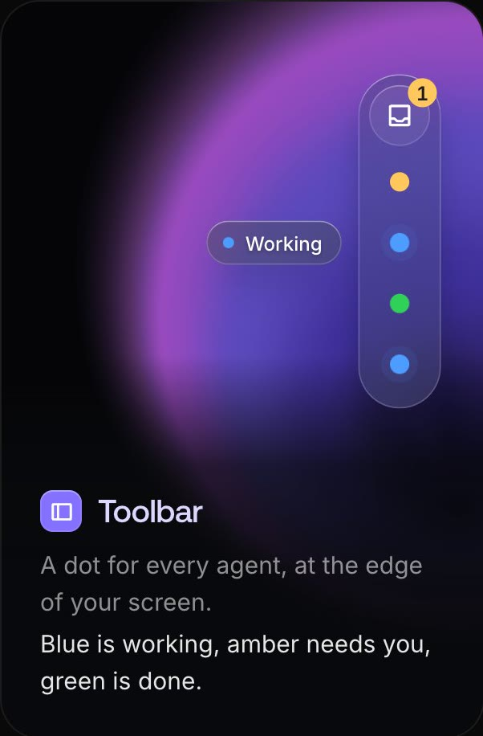
*Marketing card: dot colours and the hover label.*

### 4. Inbox card: an agent needs you
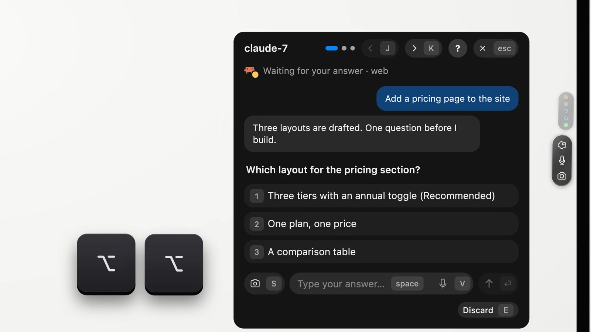
*One card per waiting agent. Header: agent name, page dots (which card of how many), J / K to move, ? for help, Esc to close. Then status line, the last user message (blue bubble), the agent's last message (grey bubble), the question in bold, numbered options, and a reply row. Launch video.*

- Opens to the left of the toolbar, top-aligned with the Inbox button, with a
  small pointer nub toward it (`one-app/demo/t_05.jpg`).
- Status line: agent icon with a coloured badge + "Waiting for your answer ·
  web" (the `· web` is the project/folder).
- Options are full-width rounded rows with a key cap "1", "2", "3"; the
  recommended one carries a "Recommended" tag. These mirror the agent's own
  numbered prompt in the terminal.
- Reply row: camera (S = screenshot), "Type your answer…" (space focuses it),
  mic (V = voice), send (↑ / ↩). Bottom-right: "Discard E".

### 5. Answer sent, with undo
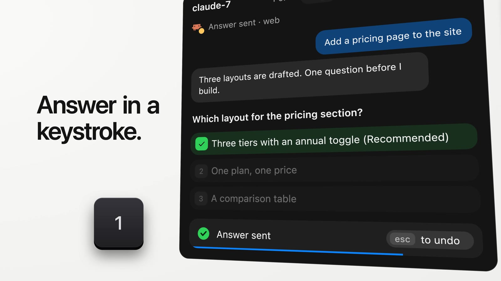
*Pressing 1 ticks the option in green, dims the rest, and shows "Answer sent · esc to undo" with a blue bar that drains over 2 s. Only then is the key sent.*

"Take it back: every answer waits 2 seconds. Press Escape to undo." The card
then advances to the next waiting agent; the status line reads "Answer sent".

### 6. Finished card with next steps
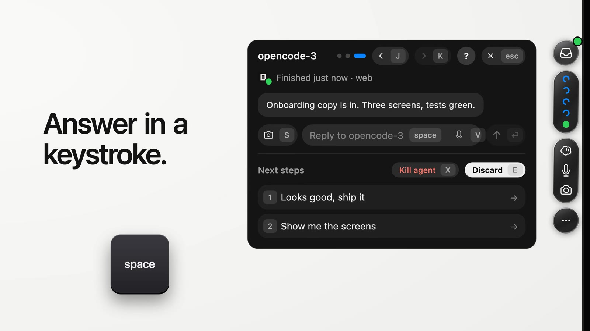
*A finished agent gets a card too: "Finished just now · web", the agent's last message, a reply row, and up to two suggested next steps (1, 2). "Kill agent X" and "Discard E".*

### 7. Empty Inbox
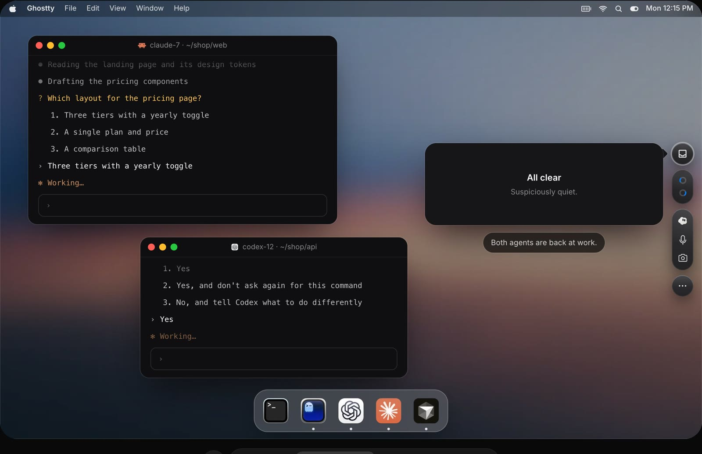
*When the queue is empty: "All clear · Suspiciously quiet." (launch video: "Nothing needs you. Suspiciously quiet. Questions and finished work land here."). The agent dots switch back to spinners.*

### 8. Agent list (multiple agents, grouping)
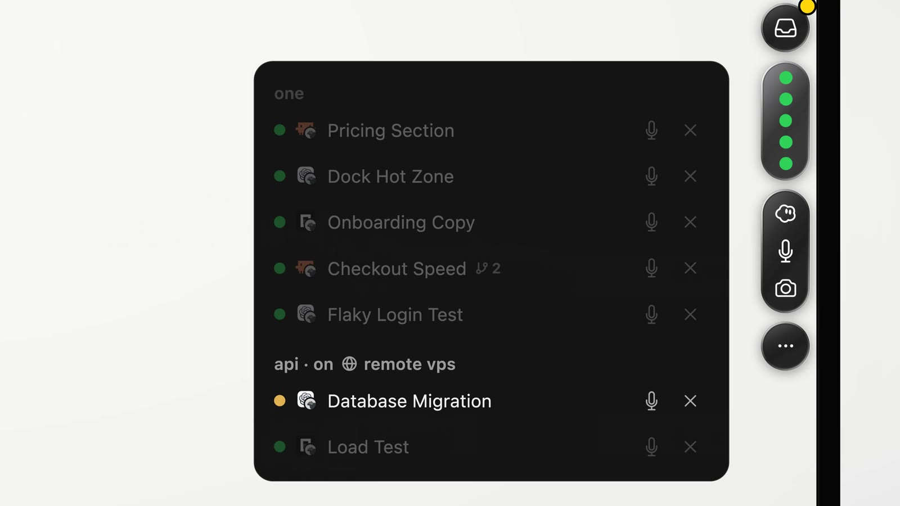
*Pointing at the dots capsule opens the list of all agents, grouped by project ("one", "api · on 🌐 remote vps"). Row: status dot, agent icon, AI title, worktree/branch count ("⑂ 2"), mic, ×. Rows that need nothing are dimmed; the waiting one is bright.*

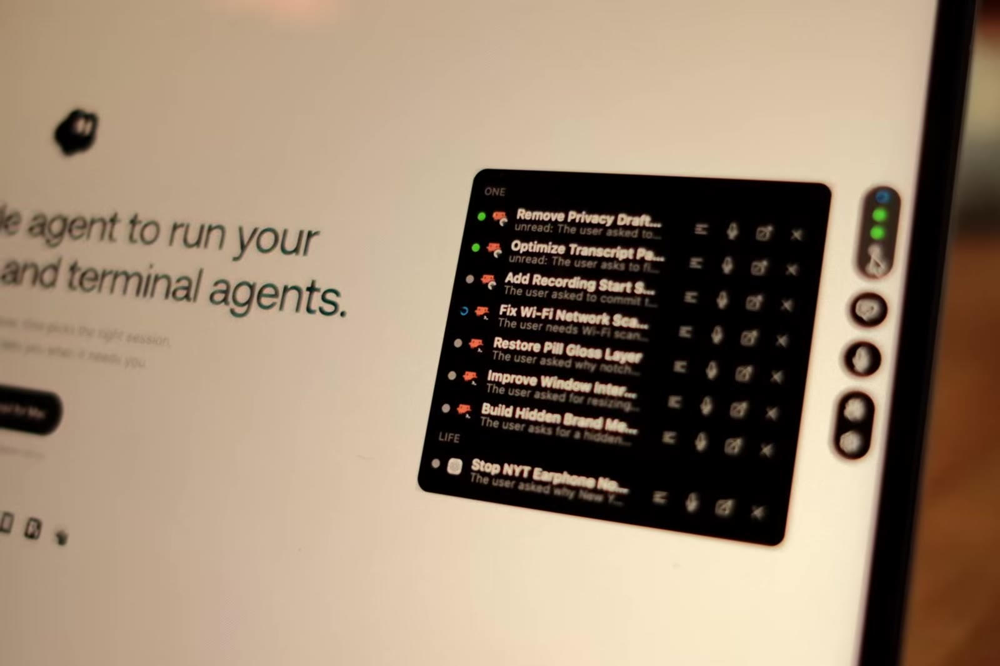
*Early build (founder video): groups "ONE" and "LIFE", each row has title + "unread: summary", and four actions: transcript, voice, open, close.*

### 9. Router ("Press to talk")
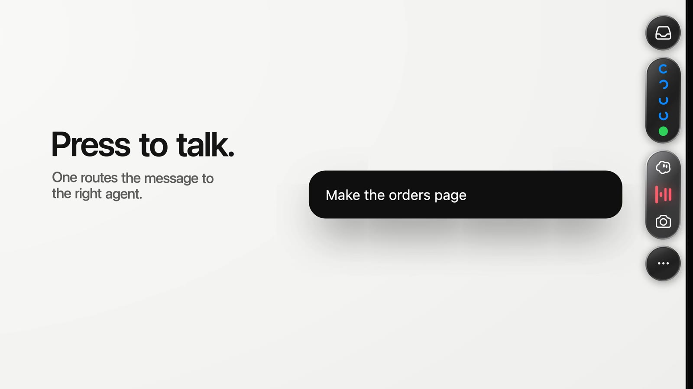
*Double-tap Option (or click the mascot/mic). The mic turns into a red waveform and a wide black capsule shows the live transcript. One picks the agent and confirms "Sent to @codex-9 · remote vps".*

In the early build, recording showed a red mic with a trash/pause capsule,
and the camera offered "Capture a region" (`one-app/hi/f_64.jpg`). After sending,
the mic button briefly turns into a big green check (`one-app/hi/f_67.8.jpg`).

### 10. Chat window (torn off)
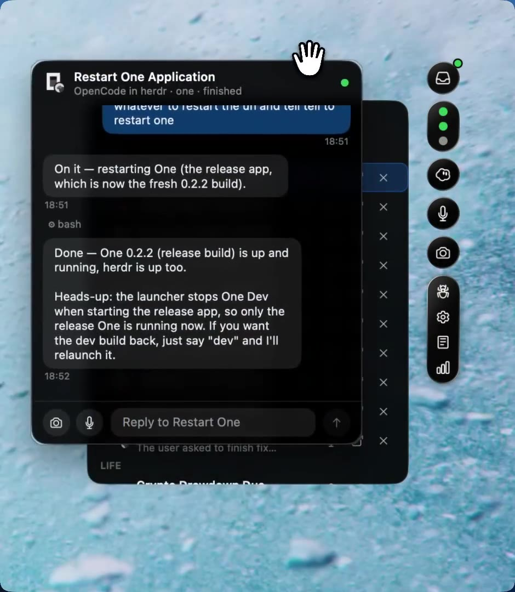
*Opening an agent shows a floating chat window: icon, title, "OpenCode in herdr · one · finished", green dot, transcript bubbles with tool lines ("⚙ bash") and times, and a composer (camera, mic, "Reply to …", send). The hand cursor shows it can be dragged off the list.*

Header controls in the founder video: open in terminal (↗) and close (×)
(`one-app/hi/f_53.jpg`). The user's message footer shows "1 screenshot · 15:33 ·
sent ✓", and a live "Release One 0.1.12 is working…" row with a blue spinner.

### 11. Usage popover
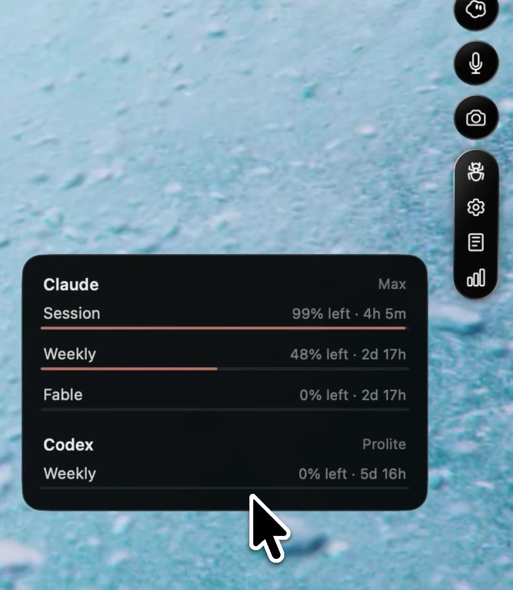
*Hovering the usage button: Claude (Max) session and weekly limits with bars, Codex (Prolite) weekly. Sept 2026 build.*

### 12. iPhone
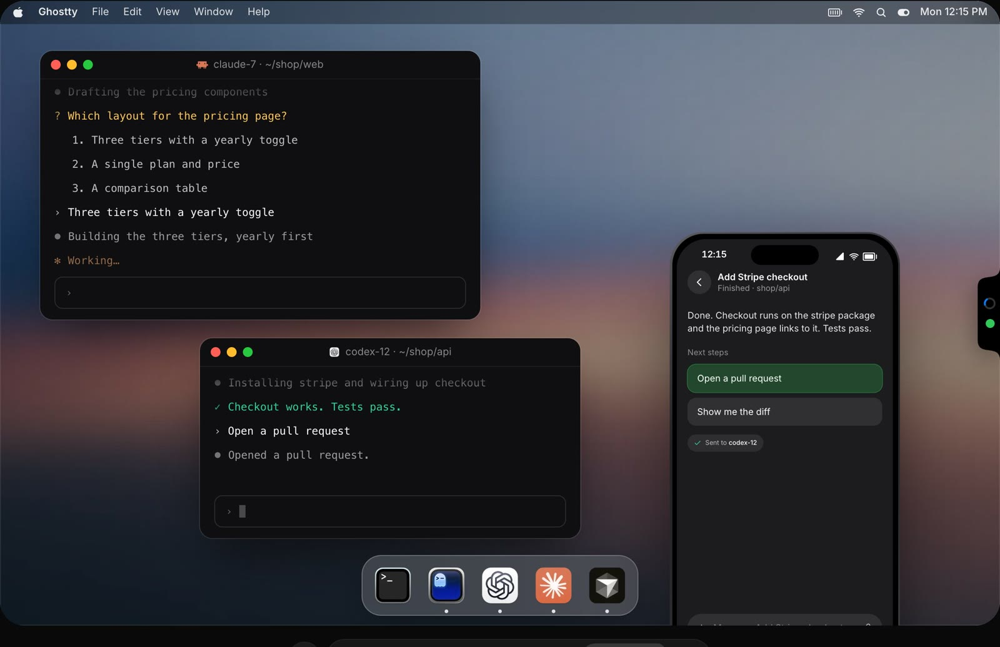
*Lock-screen notification "codex-12 · Finished in api. Take a look." opens the same card: last message, "Next steps" buttons, "Sent to codex-12" chip. The Mac pill behind it shows one spinner and one green dot.*

## Interactions and shortcuts

| Input | Effect | Source |
|---|---|---|
| Hover the pill / its hot zone | Expands to the toolbar | DOM transition; `one-app/xs/f_001-002` |
| Click Inbox button | Opens the Inbox card | launch video `xl/f_047` |
| Hover or click the dots capsule | Opens the agent list | founder video `hi/f_32.5` (pointer on the dots), launch video |
| 1 / 2 / 3 | Answer the numbered question | homepage |
| Esc (within 2 s) | Undo the answer | homepage, `xl/f_021` |
| J / K | Previous / next card | homepage, `xl/f_018` |
| E | Clear (discard) the card | homepage |
| X | Kill agent (on finished cards) | `xl/f_024` |
| Space | Focus the reply field | `xl/f_018` |
| S | Attach a screenshot | `xl/f_018` |
| V | Voice reply | `xl/f_018` |
| ? | Help | `xl/f_018` |
| Double-tap ⌥ | Router: talk or type a request | homepage |
| Drag over screen | "Point at it": region screenshot sent with the request | homepage |

Behaviour rules seen or stated:
- Pill is always on screen (guess: in all Spaces, above full-screen apps;
  not confirmed).
- A newly blocked agent shows the toast; the Inbox badge counts waiting
  cards.
- A card leaves the Inbox when answered (after the 2 s undo), discarded, or
  when the agent moves on by itself.
- One "doesn't keep working on its own": suggestions reach an agent only
  when you pick them (FAQ).
- The Inbox does not steal keyboard focus by itself (guess, from the FAQ
  wording "One acts when you send it a request or answer in the Inbox").
- Pill position: right edge, vertically centred. No drag of the pill itself
  was seen. The author's own task "Make the pill's hot zone easier to hit
  … The hot zone overlaps the Dock" (`xl/f_022`) suggests the hover zone is
  a strip along the edge and they had to keep it clear of a side Dock.
  Moving the pill to another edge or screen: not seen.

## Visual design

| Aspect | Value | Evidence |
|---|---|---|
| Pill | 25 × 104 px black notch shape, outward curves, grows with agents | DOM SVG |
| Status glyphs | 13 px (pill), 11 px (capsule); blue `#0a84ff` spinner ring, amber, green `#30d158`, grey | DOM classes |
| Toolbar buttons | 34 px circles/capsules, glossy dark gradient, 8–12 px gaps between groups | DOM |
| Cards and windows | near-black `#121214`-ish, radius ~20–24 px, no translucency, large soft shadow | frames |
| Option rows | full-width, radius ~12 px, `white/6` fill, key-cap chip on the left; chosen row turns dark green with a green check | `xl/f_021` |
| Bubbles | user: deep blue `#0b3d7a`-ish, right-aligned; agent: `#2a2a2c` grey, left | `xl/f_018` |
| Type | SF Pro; title ~17 pt semibold, body ~15 pt, meta ~13 pt `white/55` | frames |
| Toasts | black capsule, white text, 1 px light ring | `xl/f_016`, `demo/t_05` |
| Motion | spring scale+fade from the edge; staggered spinners; 2 s draining undo bar; card pages slide (page dots) | DOM, videos |
| Material | **Opaque glossy black**, not Liquid Glass. The marketing cards use translucent glass, the app does not. | frames vs `page/cards_*` |

Sizes are in the mockup's CSS pixels. The mockup screen is ~1120 px wide with
a 26 px menu bar, close to real points, so real sizes are probably within
±10 % (estimate).

## Design takeaways for Herdlight

Herdlight's status area (DESIGN.md §12) already has the right data:
`agent_status`, `completion_seq`, "finished, not seen". One shows the best
place and shape to put it, and the cheapest way to answer.

### Copy
1. **Three colours, one meaning each.** Blue spinning ring = working, amber
   = needs you, green = finished and not seen, grey = idle/seen. Use them
   in the sidebar rows, tab capsules and status area too, always with a
   word or symbol (DESIGN §5.9 already requires that).
2. **The "Inbox" as the status area's core.** One card per blocked or
   finished-not-seen agent, oldest first; J/K to move, E to clear (= mark
   seen), Esc to close. It is the §12 row list made actionable.
3. **Number keys answer numbered prompts.** One proves the generic route
   works: read the agent's own numbered options and send the digit with
   `pane.send_input`, after re-reading the screen to check the question is
   unchanged (One's connector does exactly this). This fits D19 (generic
   blocked panel) without per-agent regex.
4. **2-second undo before sending.** "Answer sent · esc to undo" with a
   draining bar. Cheap, and it removes the fear of one-key answers.
5. **Grouped agent list**: by workspace (One: project), with host name for
   remote hosts ("api · on devbox"). Matches our sidebar model.
6. **Pace.** Spinners with different speeds, one-line toasts ("Sent to
   claude-7"), the empty state "Nothing needs you". Small touches, no cost.

### Adapt
1. **A floating edge pill, as an option, macOS only.** A borderless
   non-activating `NSPanel` (`.nonactivatingPanel`, `level = .statusBar`,
   `collectionBehavior = [.canJoinAllSpaces, .fullScreenAuxiliary]`) drawn
   with SwiftUI, hosting the same Inbox view as the sidebar status area.
   Keep it out of v1 core: the sidebar status area and notifications come
   first; the pill is a second window on the same observable state, not a
   second model. Ship it in a later phase if users ask.
2. **Material.** One uses opaque glossy black. We target macOS 26: use
   `.glassEffect()` on the pill and toolbar buttons (chrome only, per §14.4),
   but keep the Inbox card opaque and dark when it shows screen text,
   for the same reason we keep terminals off glass.
3. **Keyboard focus.** One needs Accessibility for a global hotkey. We need
   none if the Inbox lives in our own window (⌘-key to open it) and the
   pill only takes keys after a click. Skip global hotkeys in v1.
4. **iPhone.** One's iPhone card (question + option buttons + "next
   steps") is the right shape for our iPhone status bar sheet. Without
   One's relay we only get it while the app is open (§12, "iOS push later").
5. **"Open chat" from a card.** One's torn-off chat window = our pane card
   in chat view. A card's "Open" should jump to host/workspace/tab/pane
   (§12 already does this), not open a new window.

### Skip
- The Router (voice, LLM routing to "the right agent", screenshots,
  suggested next steps, AI titles and recaps). Needs microphone, screen
  recording, Accessibility and an AI backend. Against our non-goals (no
  backend) and ponytail.
- The usage popover (Claude/Codex limits). Not herdr data.
- The Linux connector and relay. herdr over SSH already gives us remote
  hosts.
- The "Move to herdr" path for agents in other terminals. We only show
  herdr panes.
- Accounts, sign-in, analytics.
